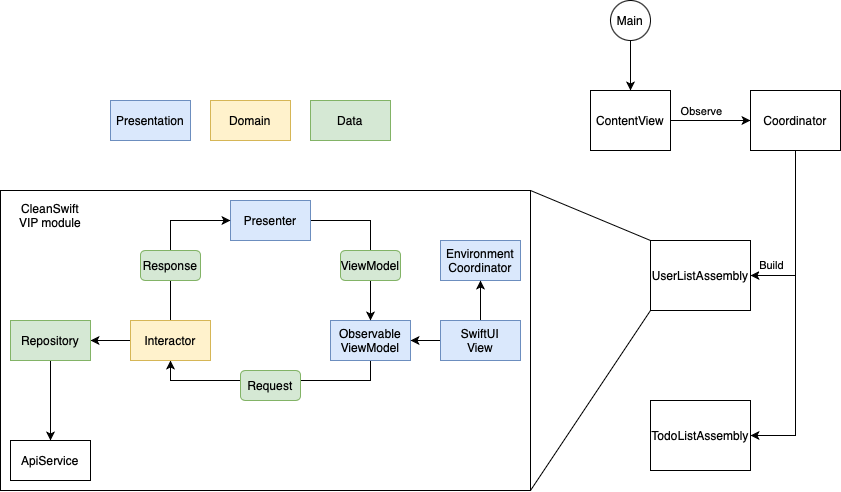

# Clean SwiftUI Architecture

This repository contains a sample application using CleanSwift Architecture consisting of two screens - a user list and their todos.

## Installation

To run this application on your device, follow these steps:

1. Ensure Xcode is installed on your computer.
2. Clone this repository to your computer.

```
git clone https://github.com/0xYanis/Clean-SwiftUI
```
   
4. Open the project file in Xcode.
5. Build and run it on the simulator or device of your choice.

## Usage

This repository demonstrates an example of using Clean Swift Architecture for app development. You can study the code and project structure to better understand the principles of Clean Swift.
At the same time, this repository shows how easy it is to create unnecessary entities in a simple application ))

## Project Structure

- **User List Screen**: Displays a list of users.
- **User Todos Screen**: Displays the todos for the selected user.

<html>
 <body>
  <p>
    
  </p>
 </body>
</html>

## Some shit

Of course, no one forces you to build an application using so many components, and you can limit yourself to something like this:

```Swift
struct UserListView: View {
    @State var users = [User]()
    
    var body: some View {
        NavigationStack {
            List(users) { user in
                Text(user.name)
            }
            .navigationTitle("Users")
        }
        .onAppear {
            Task {
                let url = URL(string: "https://jsonplaceholder.typicode.com/users")!
                let (data, _) = try! await URLSession.shared.data(from: url)
                let users = try! JSONDecoder().decode([User].self, from: data)
                await MainActor.run(body: {
                    self.users = users
                })
            }
        }
    }
}
```
However, architecture is the foundation of the application.

## Borrowing

The following borrowings were used in this application:
- **JSONPlaceholder** [Example data](https://jsonplaceholder.typicode.com)
- **Coordinator-SwiftUI** [Coordinator by Alex Nagy](https://www.youtube.com/watch?v=aaLRST7tHFQ)

## Contribution

If you have any suggestions for improving this sample, please create an issue or submit a pull request.

## License

This project is licensed under the [MIT License](httpsopensource.org/licenses/MIT).
